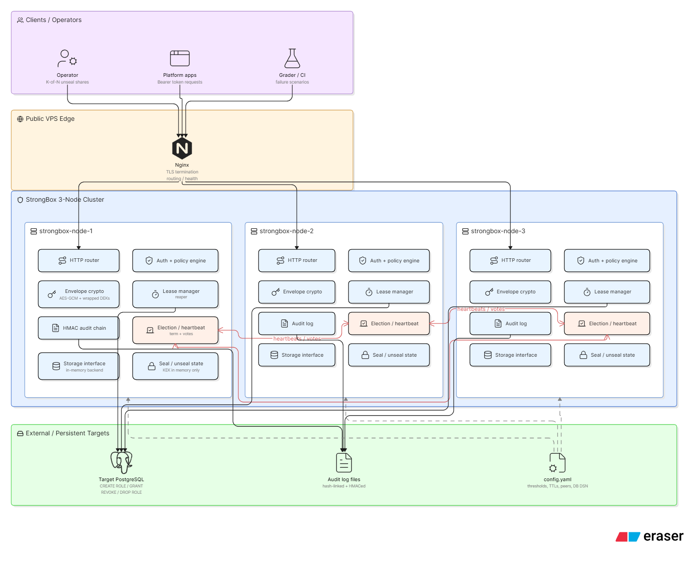

# StrongBox

## Tentative Architecture


A distributed secrets manager built from first principles.
Encryption, auth, leasing, leader election, and tamper-evident audit — all in Bash.

## Public cluster URL

> TODO: add your VPS domain/IP after provisioning

## Quick start (fresh VPS)

```bash
# 1. Clone
git clone https://github.com/ceoemyrex/strongbox && cd strongbox

# 2. Set secrets
echo "PG_PASSWORD=$(openssl rand -hex 16)" > .env

# 3. Get TLS cert (replace with your domain)
certbot certonly --standalone -d yourdomain.com

# 4. Start the cluster
docker compose up -d

# 5. Init (one-time — save the output)
curl -s -X POST https://yourdomain.com/v1/sys/init | tee init.json

# 6. Unseal (submit K shares)
SHARE1=$(jq -r '.shares[0]' init.json)
SHARE2=$(jq -r '.shares[1]' init.json)
curl -s -X POST https://yourdomain.com/v1/sys/unseal -d "{\"share\":\"$SHARE1\"}"
curl -s -X POST https://yourdomain.com/v1/sys/unseal -d "{\"share\":\"$SHARE2\"}"

# 7. Verify unsealed
curl -s https://yourdomain.com/v1/sys/health
```

## Architecture

See `docs/architecture.png`.

## Threat model

See `docs/threat-model.md`.

## Nonce strategy

Every secret value in StrongBox is encrypted with envelope encryption, and
every encryption operation needs a fresh nonce (initialisation vector). This
section explains what nonces we use, where they come from, and why.

### What we use

Random 128-bit IVs from `/dev/urandom` for every AES-256-CTR operation.
Two independent IVs per envelope:

- `nonce_dek` — IV for encrypting the secret value with the per-secret DEK
- `nonce_kek` — IV for encrypting the DEK bundle with the master KEK

Both IVs are generated fresh on every call to `crypto_encrypt`. They are
stored alongside the ciphertext in the envelope so decryption can recover
them — IVs are not secret, they only need to be unique per key.

### Why random and not a counter

The two reasonable choices for a CTR-mode IV are:

1. A counter that increments with every encryption and persists across restarts
2. A random value drawn from a cryptographically secure RNG on every call

We picked (2). A counter would require atomic disk persistence — every
encryption would have to write the new counter value before using it,
otherwise a crash could reuse a counter and break the security of every
secret that ever used the same key. Persisting that counter means writing
key-adjacent state to disk, which reintroduces the exact threat the
sealed/unseal design exists to avoid: an attacker with disk access learns
something about the key material's history.

### Why 128 bits and not 96

AES-GCM conventionally uses 96-bit nonces. We use 128-bit nonces because
`openssl enc -aes-256-ctr` (which StrongBox uses, since `openssl enc` does
not support AEAD ciphers in OpenSSL 3.x) requires a full 128-bit block
for its `-iv` parameter. The extra 32 bits don't hurt — they only widen
the birthday bound further.

### Collision safety

With random 128-bit IVs, the probability of two encryptions ever picking
the same IV under the same key follows the birthday bound. The collision
probability stays below 2⁻³² after roughly 2⁴⁸ encryptions per key — about
281 trillion writes. At realistic secret-write rates (say, 1000 writes/sec
sustained, which is far beyond any expected workload), reaching that bound
would take 8000+ years.

For the DEK layer, this concern is essentially moot — each DEK is fresh
per secret, so the DEK is used for at most one encryption in its lifetime.
The bound matters only for the KEK layer, where the master key encrypts
the DEK bundle for every secret. Even there, 2⁴⁸ is comfortably out of
reach.

### Implementation reference

Nonce generation in `lib/crypto.sh`:

```bash
nonce_dek="$(openssl rand -hex 16)"
nonce_kek="$(openssl rand -hex 16)"
```

`openssl rand` reads from the system CSPRNG (`getrandom(2)` on Linux,
which is `/dev/urandom` after the entropy pool is initialised).

### Verification

`test/unit/test_crypto.sh` includes a uniqueness check that calls
`crypto_encrypt` 50 times with the same plaintext and asserts every
`(nonce_dek:nonce_kek)` pair is unique. The same test also verifies
that encrypting the same plaintext twice produces two different envelopes
— a regression test for the "are we actually randomising the IV"
question.

## Memory hygiene

The seal/unseal design depends on a single guarantee: after the operator
submits K shares and the cluster transitions to unsealed, no submitted
share value, no intermediate buffer, and no copy of the reconstructed
master key remains in process memory except the one deliberate copy the
crypto layer needs.

This section describes what gets zeroed, when, and how we verify it.

### What gets zeroed

After a successful unseal, all of the following are overwritten with
zero-bytes and then cleared:

| Variable | Lives in | When zeroed |
|---|---|---|
| Each submitted share | `_SHARES_COLLECTED` in `seal.sh` | Immediately after reconstruction succeeds |
| The reconstructed bundle (128 hex chars) | local `bundle_hex` in `_seal_reconstruct_and_unseal` | Before the function returns |
| The encryption key half | local `enc_key` in `_seal_reconstruct_and_unseal` | Before the function returns |
| The HMAC key half | local `hmac_key` in `_seal_reconstruct_and_unseal` | Before the function returns |
| Share buffers inside the GF(2⁸) reconstruction | Python `bytearray` in `shamir.py` | Before `shamir.py` exits |
| Coefficient arrays during Lagrange interpolation | local lists in `shamir.py` | Per-byte, inside the inner loop |
| The KEK pair, after `seal_seal` is called | `_STRONGBOX_KEK`, `_STRONGBOX_HMAC_KEK` in `crypto.sh` | On `/sys/seal` |
| The HTTP handler's local share variable | local `share` in `_handle_sys_unseal` | After `seal_submit_share` returns |
| The root token, after consumption | `_ROOT_TOKEN` in `seal.sh` | When `seal_clear_root_token` is called |

### When zeroing happens

The lifecycle of a share value from arrival to disposal:

1. **HTTP receive** — `http.sh` parses the share from the request body into a
   local variable named `share`
2. **Submit** — handler calls `seal_submit_share`, which validates the
   share and appends it to `_SHARES_COLLECTED`
3. **Threshold** — when the K-th share arrives, `seal_submit_share` calls
   `_seal_reconstruct_and_unseal`
4. **Reconstruct** — shares are piped (via stdin, never argv) to `shamir.py`,
   which performs GF(2⁸) Lagrange interpolation and prints the 128-hex
   bundle on stdout
5. **Zero in Python** — `shamir.py` overwrites every share bytearray and
   the reconstructed secret bytearray with zeroes before exit
6. **Load** — Bash splits the bundle at offset 64 into `enc_key` and
   `hmac_key`, calls `crypto_set_kek` to load both into the deliberate
   memory copies
7. **Zero in Bash** — `_seal_reconstruct_and_unseal` overwrites `bundle_hex`,
   `enc_key`, `hmac_key` with zero-strings, then assigns empty strings
8. **Zero collected shares** — `_zero_collected_shares` overwrites each
   entry in `_SHARES_COLLECTED` with zero-bytes, then `unset`s each entry,
   then re-initialises the array as empty
9. **Caller cleanup** — back in `_handle_sys_unseal`, the local `share`
   variable is overwritten with zeroes before the function returns
10. **Flip state** — only after every zeroing step succeeds does
    `_SEALED=false` flip; if any step fails, the vault stays sealed

### Why two steps to zero one variable

Bash gives no way to actually scrub memory. The shell may copy variable
contents during string operations, append history, or hand allocations
back to the system allocator without zeroing. What we *can* do is:

```bash
zero="$(head -c "${#var}" /dev/zero | tr '\0' '0')"
var="${zero}"
var=""
```

This overwrites the variable's current allocation with a string of zero
characters of the same length, then assigns an empty string. The
allocation is the same one Bash used to hold the secret, so the bytes
on the heap get overwritten. This is a best-effort defence — a
sufficiently determined attacker with the right access can still read
older copies the shell may have made. The point is to close the obvious
window, not to provide cryptographic guarantees about RAM contents.

For the deliberate KEK copies in `crypto.sh`, the same pattern applies
in `crypto_clear_kek`. For the Python share buffers in `shamir.py`, we
use `bytearray` (mutable) rather than `bytes` (immutable) specifically
so we can write zeroes into the existing allocation rather than relying
on garbage collection.

### Where shares never appear

In addition to the active zeroing above, shares are routed in a way that
keeps them off other surfaces an attacker might inspect:

- **Not on the command line.** `shamir.py` reads shares from stdin, never
  from argv. They never appear in `/proc/PID/cmdline`, `ps`, `wchan`, or
  shell history.
- **Not in shell history.** Shares submitted via HTTP arrive in the
  request body, not as a command argument. There is no shell expansion
  of share values anywhere in the codebase.
- **Not in audit logs.** The audit chain records *that* a share was
  submitted (token, op, path, timestamp), not the share value itself.
- **Not in environment.** No `export` of any KEK, share, or bundle.
  The KEK pair lives in `_STRONGBOX_KEK` and `_STRONGBOX_HMAC_KEK`,
  which are module-level Bash variables, not exported to subprocesses.

### How we verify it

The memory-hygiene assertions live in `test/unit/test_seal.sh` and
`test/unit/test_sys_handlers.sh`. The methodology:

1. Init the vault, capture the share values as 32-character fingerprints
2. Submit the shares — vault unseals
3. Clean up caller-side variables (the test acts as a simulated HTTP
   handler — same cleanup pattern `http.sh` uses in production)
4. Run `declare -p` to dump every Bash variable currently in memory
5. Filter out the test's own fingerprint variables (otherwise the search
   needle becomes its own false positive)
6. Assert each share fingerprint does NOT appear in the dump
7. Assert each half of the KEK appears in exactly one variable — its
   canonical home in `crypto.sh`
8. Call `seal_seal`, re-dump, and assert both halves of the KEK are now
   gone

The `screenshots/memory-clean.png` referenced in the deliverables shows
the equivalent check against the live process via `gcore` — dumping the
running `strongbox` process and grepping for share values and KEK
prefixes. The expected result: zero hits for share data, exactly one hit
each for the two halves of the KEK before seal, and zero hits for either
half after seal.

### What this doesn't protect against

- A compromised host OS. Root on the host can read any process's memory
  in real time via `ptrace` and `/proc/PID/mem`. We don't defend against
  this — an HSM or TPM would.
- Hardware-level extraction. Cold-boot attacks, DMA attacks via FireWire
  or Thunderbolt, etc. The host is assumed to be trusted hardware.
- Memory allocator behaviour. Bash and Python rely on glibc malloc,
  which may not return freed pages to the kernel and may reuse old
  allocations for new variables. We zero what we can address; what the
  allocator does behind our back is outside our control.

## Election protocol

TODO: 200–400 word explanation of term numbers, vote rules, partition behaviour.

## API examples

TODO: curl examples for each of the 10 grading scenarios.

## Running tests

```bash
export STRONGBOX_URL=https://yourdomain.com
export STRONGBOX_ROOT_TOKEN=<root token from init>
bash test/integration/run_all.sh
```

## Repo structure

```
bin/strongbox            Main server entrypoint
bin/strongbox-verify     Audit log verifier
lib/crypto.sh            Envelope encryption
lib/auth.sh              Tokens and policy engine
lib/lease.sh             Lease lifecycle and reaper
lib/dynamic.sh           Dynamic Postgres credential engine
lib/consensus.sh         Leader election
lib/audit.sh             HMAC audit chain
lib/seal.sh              Seal/unseal state machine
lib/storage.sh           In-memory storage interface
lib/http.sh              HTTP routing
lib/shamir.py            GF(2^8) Shamir reconstruction (Python)
test/integration/        One script per grading scenario
nginx/nginx.conf         TLS termination config
compose.yaml             3-node cluster definition
config.yaml              All tuneable thresholds and TTLs
docs/threat-model.md     Trust boundaries and limitations
```